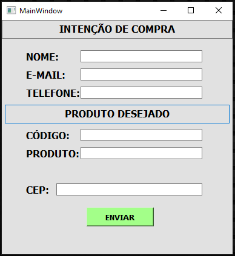
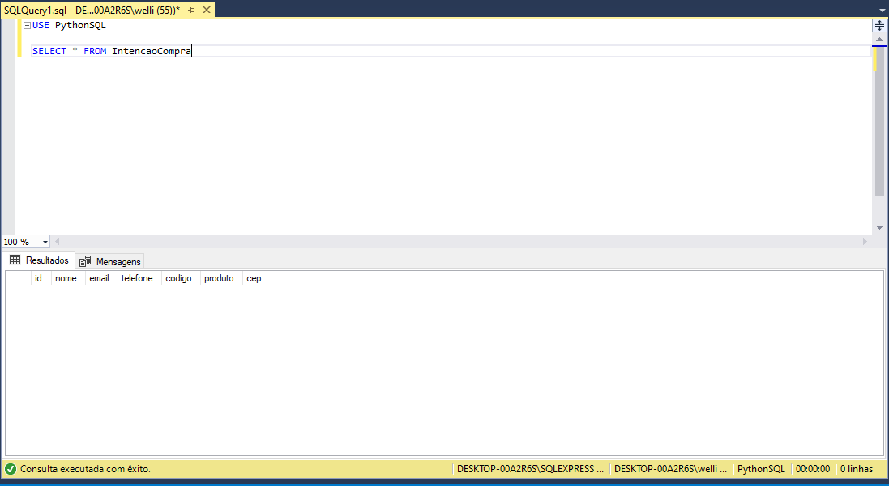
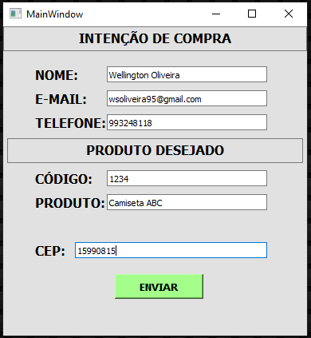
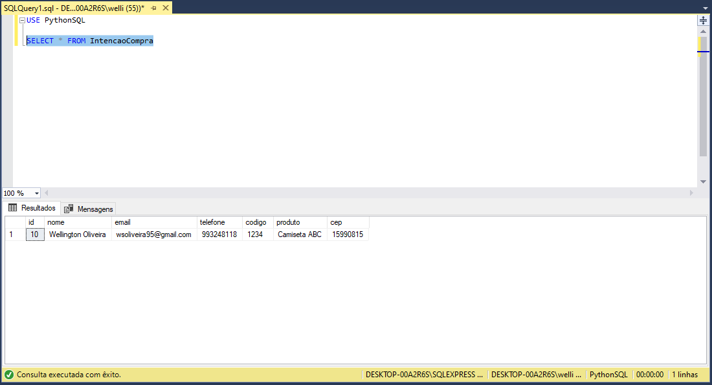
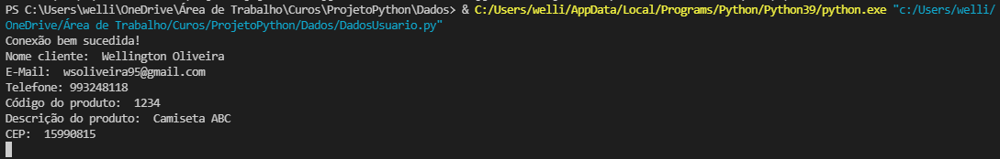

# PROJETO PYTHON INTEGRADO COM BANCO DE DADOS

## Sobre o projeto:
Neste projeto utilizei como linguagem o **Python** com a biblioteca **Qt Designer** e integrei com o banco de dados **SQL Server**.

Nele consigo fazer o cadastro de um produto utilizando algumas linhas e quando clicado no botão "Enviar" automaticamente os dados ali inseridos são registrados no banco de dados. Neste caso minha ideia é de que uma loja registre os produtos que estão faltando e os clientes solicitam, para que em dia de compra de produtos tenha tudo facilitado em suas mãos. Além de que estes dados podem gerar estatisticas dos mais solicitados para que futuramente possa ser adquirido mais unidades, por exemplo.

## Demonstração: 

Nesta tela podemos observar a janela modelada via **QT Designer** sem preenchimento dos campos:

Já aqui, observa-se o banco de dados vazio:

Após o preenchimendo dos campos na janela do **QT Designer** e clicar em "Enviar":

Podemos ver o banco de dados atualizado automaticamente na imagem abaixo:

Também abaixo segue execução pelo Python:

## Autor:
Wellington Oliveira,

Linkedin: https://www.linkedin.com/in/wellingtonsoliveira/
